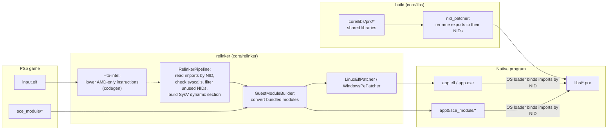
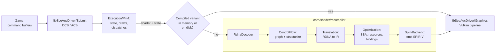

# Architecture

How a PS5 executable becomes a native Linux or Windows program. Nothing is emulated: the converted executable runs as a normal process and calls native implementations of the system libraries.

## Overview

- [`core/relinker/main.cpp`](../../core/relinker/main.cpp) runs the steps in this order. `--to-intel` is optional, see [USAGE.md](../user/USAGE.md).
- Each library in [`core/libs/prx`](../../core/libs/prx) builds as a shared library. After the build, `nid_patcher` ([`core/libs/nid`](../../core/libs/nid)) renames every export to its NID, computed from the function name. `APS5_EXPORT("<nid>", func)` sets the NID directly when the name is unknown.

## Thread cancellation

[`Thread.cpp`](../../core/libs/prx/libkernel/Pthread/src/Thread.cpp) records cancellation requests on the target guest thread. New threads start with cancellation enabled and deferred. A disabled request stays pending; enabling deferred cancellation returns before the next cancellation point acts on it. Repeated requests do not add cleanup invocations.

[`Cancel.hpp`](../../core/libs/prx/libkernel/Pthread/include/Cancel.hpp) connects condition, semaphore and join waits to the request. A canceled condition waiter reacquires its guest mutex before cleanup. Semaphore and join waits release their internal locks before exiting. A request pending on entry to a semaphore wait is acted on before consuming an available token; a canceled join leaves its target joinable and its result output untouched.

Cancellation exits through `scePthreadExit` with result pointer `1`. It runs cleanup handlers in reverse push order before thread-specific destructors; cancellation points inside cleanup must not start another exit. The host thread then terminates through the existing Windows or Linux lifecycle, and join waits for that termination. Host thread termination is not used to inject cancellation into a running guest frame.

The reference contract and constants come from FreeBSD libthr, pinned at [`5ed7eb0d`](https://github.com/freebsd/freebsd-src/blob/5ed7eb0d97ba4436218e810f61bd059acba984c2/lib/libthr/thread/thr_cancel.c), with cleanup and exit ordering in [`thr_exit.c`](https://github.com/freebsd/freebsd-src/blob/5ed7eb0d97ba4436218e810f61bd059acba984c2/lib/libthr/thread/thr_exit.c#L196-L259). These are reference semantics, not console measurements. The supported cancellation points and incomplete asynchronous behavior are listed in [TechnicalDebt](TechnicalDebt.md).

[`GuestPthreadCancelRecovery.cpp`](../../core/libs/tests/GuestPthreadCancelRecovery.cpp) checks pending requests before ordinary and timed semaphore acquisition, cleanup reentrancy and destructor ordering, enabled and disabled timed condition waits, canceled join output, and subsequent resource and thread reuse. Host atomic gates establish pending requests; acquiring the condition mutex after the worker releases it establishes wait entry without a scheduling sleep. Both `guest_pthread_cancel_recovery` and `guest_pthread_cancel_recovery_coarse` retain checks in Release and have a 20-second timeout, shorter than the 60-second guest waits. The latter sets `APS5_COARSE_TIMED_WAITS=1` to exercise the Windows fallback; Linux uses that condition-variable path by default.

## Graphics

- [`Recompiler.cpp`](../../core/shader/recompiler/Recompiler.cpp) runs the stages in this order. With `ANYPS5_ENABLE_SPIRV_TOOLS`, the SPIR-V is also validated and optimized with SPIRV-Tools.
- `ShaderRecompiler::Recompile` keeps compiled variants in memory, and `ShaderDiskCache` stores them on disk so later runs reuse them.
